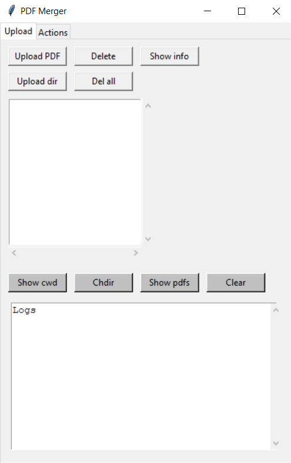

# PDF Merger

This is an express-made project which allows basic modification of pdf files.

## Motivation

At a certain point, I grew frustrated with the limited performance and reliability of online PDF mergers. That's when I had an idea: 'Why not create my own PDF merger in Python?' So, I dedicated an hour to experimenting with the concept, and here are the initial results. While this project isn't in its final state, it does offer basic functionality.

## Description

Desktop App uses PyPDF2 library to perform operations on pdf files and tkinter for the UI.
App operates in the chosen directory, allows uploading and removing desired pdf files and merging or splitting files from the 'Actions' tab.

## Authors

Adam Rogowski
